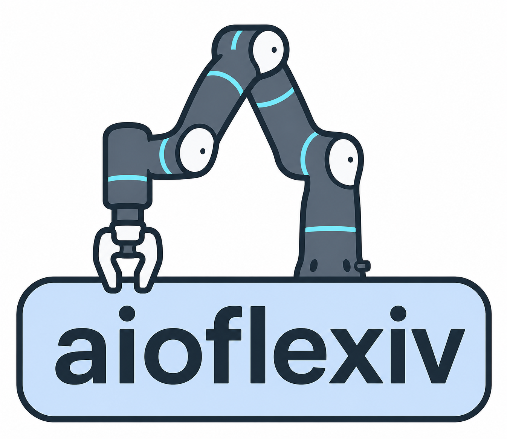

# aioflexiv

<div align="center">
  
</div>
<p align="center">
  <a href="https://pypi.org/project/aioflexiv/">
    
  </a>
  <a href="https://opensource.org/licenses/Apache-2.0">
    
  </a>
</p>

**aioflexiv** is an experimental asyncio-based Python library for controlling
Flexiv robots from a Python-owned real-time torque loop. It combines
**`flexivrdk`** for Flexiv robot access, a small **`pybind11`** shim for RT
joint-torque mode, and **`Ruckig`** for smooth joint-space trajectory
generation.

The library is designed for research workflows that need direct torque control,
joint impedance control, operational-space control, and minimal ceremony around
async Python experiments.

If you want the same kind of Python control workflow for a Franka FR3 robot,
check out [aiofranka](https://github.com/Improbable-AI/aiofranka).

This is a hardware-control experiment. Keep clear of the robot, verify your
limits, and be ready to stop the robot before running any command or script.

## Installation

Install from PyPI:

```bash
pip install aioflexiv
```

Or install this repository for development:

```bash
git clone https://github.com/Improbable-AI/aioflexiv.git
cd aioflexiv
pip install -e .
```

The install pulls `flexivrdk==1.9.1`, `mujoco`, `numpy`, and `ruckig`, builds the
`pybind11` RT shim from source, and installs the `aioflexiv` console command.
PyPI releases are source distributions, so installation requires a local C++17
compiler.

## Quick Start

Run the torque loop in-process with asyncio:

- **Single script**: no separate server process
- **Direct access**: controller state and commands stay in Python
- **Async discipline**: avoid blocking calls after `controller.start()` because
  the background torque loop must keep stepping

Pass the serial explicitly on first use. After a successful connection,
aioflexiv stores it in `~/.config/aioflexiv/config.json`; later scripts can use
`FlexivController()` or `FlexivController(None)` to reuse the latest serial.
Pass `tool="<TOOL_NAME>"` to switch the robot's active Flexiv tool before the
real-time torque loop starts. When the MuJoCo model backend is active, aioflexiv
also reads the active Flexiv tool payload and injects it into the MuJoCo model
used for OSC dynamics.

Use `FlexivController("mujoco")` to run the same controller against the bundled
MuJoCo Flexiv scene instead of hardware. The simulator opens a passive MuJoCo
viewer when the platform supports it and advances physics at 1 kHz by default.
Import `ToolPayload` from `aioflexiv` and pass
`mujoco_tool_payload=ToolPayload(...)` to test a simulated payload.

```python
import asyncio
import numpy as np
from aioflexiv import FlexivController

async def main():
    controller = FlexivController("<ROBOT_SN>", tool="MyGripper")

    await controller.start()
    try:
        await controller.move()

        controller.switch("impedance")
        controller.kp = np.ones(controller.dof) * 80.0
        controller.kd = np.ones(controller.dof) * 4.0
        controller.set_freq(50)

        q0 = controller.initial_qpos.copy()
        for cnt in range(250):
            target = q0.copy()
            target[0] += 0.05 * np.sin(cnt / 50.0)
            await controller.set("q_desired", target)
    finally:
        await controller.stop()

if __name__ == "__main__":
    asyncio.run(main())
```

## CLI Reference

```text
aioflexiv status [ROBOT_SN] [--network-interface IP] [--events N] [--verbose]
aioflexiv tool status [ROBOT_SN] [--json]
aioflexiv tool list [ROBOT_SN] [--json]
aioflexiv tool load TOOL [ROBOT_SN]
aioflexiv tool update TOOL [ROBOT_SN] --inertia IXX IYY IZZ IXY IXZ IYZ
aioflexiv tool calibrate TOOL [ROBOT_SN] [--tcp-location X Y Z QW QX QY QZ] [--load]
```

### `status`

Show Flexiv robot connection, system, state, tool, device, and recent event
information.

```bash
aioflexiv status <ROBOT_SN>
```

After a successful connection, aioflexiv stores the latest serial number in
`~/.config/aioflexiv/config.json`. Later CLI runs can omit `ROBOT_SN` and reuse
that saved serial:

```bash
aioflexiv status
```

Use `--network-interface` to whitelist one or more local IPv4 interfaces while
searching for the specified robot:

```bash
aioflexiv status <ROBOT_SN> --network-interface 192.168.2.10
```

### `tool`

Manage Flexiv tool payloads through the official `flexivrdk.Tool` API. Tool
changes and payload calibration require the robot to be in `IDLE`, so stop any
running torque controller first.

Show the active tool:

```bash
aioflexiv tool status <ROBOT_SN>
```

List saved tools and their payload parameters:

```bash
aioflexiv tool list <ROBOT_SN>
```

Load a saved tool on the robot. Future torque loops use the robot's active tool
for Flexiv-side gravity compensation, and the MuJoCo OSC backend reads that same
active tool payload at startup:

```bash
aioflexiv tool load MyGripper <ROBOT_SN>
```

Update only the inertia tensor of an existing tool while preserving its mass,
center of mass, and TCP. Values use Flexiv RDK ordering
`IXX IYY IZZ IXY IXZ IYZ` and units of `kg*m^2`:

```bash
aioflexiv tool update MyGripper <ROBOT_SN> \
  --inertia 0.001536 0.002346 0.001255 0.0 0.0 0.0
```

The command shows the current and proposed tensors and asks for confirmation
before applying the update. The robot must be in `IDLE`. Use `--yes` for an
explicitly non-interactive update.

Interactively calibrate payload mass, center of mass, and inertia, then save the
result as a Flexiv tool:

```bash
aioflexiv tool calibrate MyGripper <ROBOT_SN>
```

Flexiv's calibration result does not contain a valid TCP pose. For an existing
tool, aioflexiv preserves the current TCP. For a new tool, it defaults to the
flange TCP unless you provide one:

```bash
aioflexiv tool calibrate MyGripper <ROBOT_SN> \
  --tcp-location 0.0 0.0 0.12 1.0 0.0 0.0 0.0 \
  --load
```

## Core Concepts

### Torque Loop

`FlexivController.start()` starts the Flexiv RT joint-torque bridge and launches
an asyncio task that repeatedly computes and sends torque commands. Stop with
`await controller.stop()` in a `finally` block so the robot exits torque mode
cleanly.

### Safety Limits

Torque clipping is enabled by default and uses Flexiv RDK `RobotInfo::tau_max`.
No torque-rate limit is guessed by default. Set
`controller.torque_diff_limit = <Nm/s>` if you want an additional user-space
slew limit.

By default, `FlexivController(ext_offset=True)` keeps the real robot in IDLE,
averages fresh `tau_ext` samples for 0.5 seconds, and then enters
`RT_JOINT_TORQUE`. The frozen IDLE mean is applied beginning with the first
torque command as `commanded_torque - idle_tau_ext_mean`. After the mode switch,
the controller reads the current joint position and uses it as `q_desired`.
This avoids estimating the offset from the torque-mode transition transient.

Set `ext_offset_idle_average_s` to change the averaging window, or pass
`ext_offset=False` to disable the compensation. aioflexiv does not automatically
re-estimate the offset after entering torque mode; stop and restart the
controller to capture a new IDLE mean.

### Rate Limiting

Use `set_freq()` to pace command updates:

```python
controller.set_freq(50)

for target in trajectory:
    await controller.set("q_desired", target)
```

### Force/Torque Sensing

For compatible robots with an F/T sensor, `controller.robot.info["has_FT_sensor"]`
reports availability and `controller.state` exposes 6D wrench readings as NumPy
arrays:

```python
state = controller.state
raw_flange_wrench = state["ft_sensor_raw"]          # [fx, fy, fz, mx, my, mz]
tcp_wrench = state["ext_wrench_in_tcp"]             # [N, N, N, Nm, Nm, Nm]
world_wrench = state["ext_wrench_in_world"]
```

## Controllers

### 1. Joint Impedance

Joint-space spring-damper control:

```python
controller.switch("impedance")
controller.kp = np.ones(controller.dof) * 80.0
controller.kd = np.ones(controller.dof) * 4.0
await controller.set("q_desired", target_qpos)
```

**Use case**: compliant joint-space holding and trajectory tracking.

### 2. Operational Space

End-effector pose control. By default the library computes end-effector pose,
Jacobian, mass matrix, Coriolis, and gravity terms from the bundled MuJoCo
Flexiv model, tracking the `attachment_site` MuJoCo site. For Rizon 4S this site
is calibrated to the pose returned by Flexiv RDK; the coincident
`tool_mount_site` uses the physical tool-mount convention, rotated 180 degrees
about flange z. On hardware, the active Flexiv tool payload is loaded into a
temporary MuJoCo model before compilation, so OSC uses the same attached mass
properties that Flexiv uses for tool gravity compensation:

```python
controller = FlexivController("<ROBOT_SN>")
await controller.start()

controller.switch("osc")
controller.ee_kp = np.array([150, 150, 150, 20, 20, 20], dtype=float)
controller.ee_kd = np.array([20, 20, 20, 3, 3, 3], dtype=float)

target = controller.initial_ee.copy()
target[2, 3] += 0.03
await controller.set("ee_desired", target)
```

**Use case**: Cartesian holding and small task-space motions.

If automatic model selection cannot read `RobotInfo.model_name`, pass
`mujoco_model_path="models/flexiv_rizon4/flexiv_rizon4.xml"` or the matching
Rizon4S XML explicitly. Pass `model_backend="rdk"` only when you explicitly want
to compare against Flexiv RDK model data.

### 3. Direct Torque

Direct user torque commands:

```python
controller.switch("torque")
controller.set_freq(10)
await controller.set("torque", np.zeros(controller.dof))
```

**Use case**: low-level experiments where you want to own the torque command.

### 4. Ruckig Moves

Point-to-point joint motions are generated with Ruckig and tracked through the
same Python torque loop:

```python
await controller.move()
await controller.move([0.0, -0.7, 0.0, 1.57, 0.0, 0.7, 0.0])
```

## Examples

```bash
python examples/00_move.py mujoco
python examples/01_joint_impedance.py <ROBOT_SN>
python examples/02_osc_hold.py <ROBOT_SN>
```

Use `mujoco` in place of `<ROBOT_SN>` in the controller examples to open the
MuJoCo simulator. `examples/02_osc_hold.py` also accepts `--model-backend rdk`
when connected to real hardware for comparison against the Flexiv RDK model
path.

## License

Apache-2.0. See [LICENSE](LICENSE).

## Citation

If you use this library in your research, please cite:

```bibtex
@software{aioflexiv,
  author = {Park, Younghyo},
  title = {aioflexiv: Asyncio-based Flexiv Robot Control},
  year = {2026},
  url = {https://github.com/Improbable-AI/aioflexiv}
}
```

## Acknowledgments

- Built on [Flexiv RDK](https://www.flexiv.com/software/rdk)
- Trajectory generation with [Ruckig](https://github.com/pantor/ruckig)
